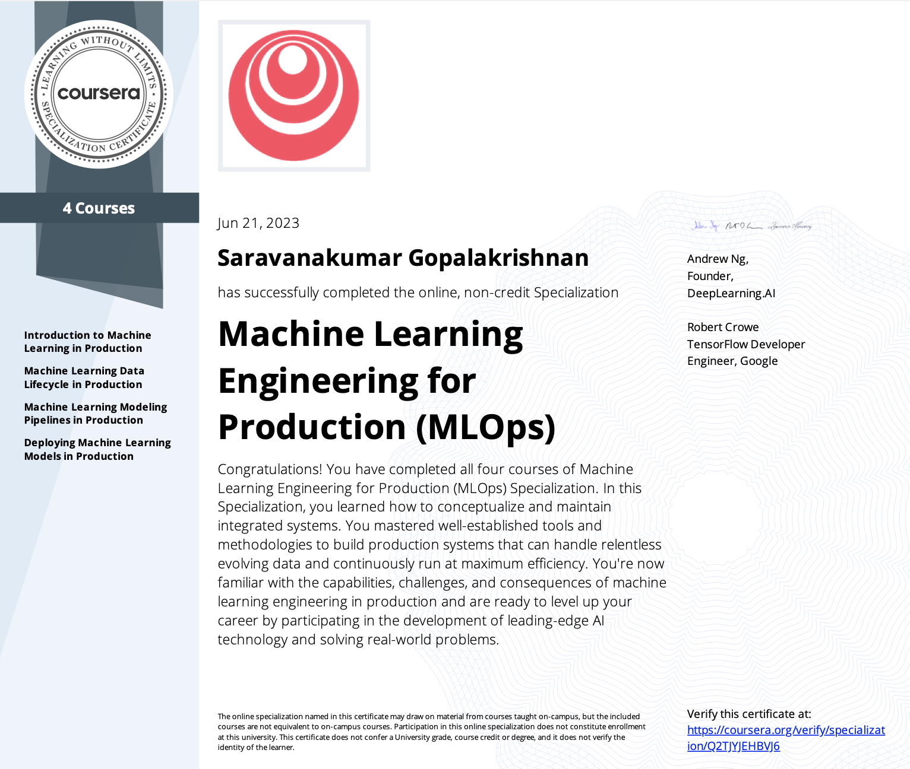

# Machine Learning Engineering for Production (MLOps) Specialization on Coursera (offered by deeplearning.ai)

Programming assignments from all courses in the Coursera [Machine Learning Engineering for Production (MLOps)](https://www.deeplearning.ai/generative-adversarial-networks-specialization/) Specialization offered by `deeplearning.ai`.

## Courses

This Specialization contains four courses namely:

1. [Course 1: Introduction to Machine Learning in Production](https://www.coursera.org/learn/introduction-to-machine-learning-in-production?specialization=machine-learning-engineering-for-production-mlops)

1. [Course 2: Machine Learning Data Lifecycle in Production](https://www.coursera.org/learn/machine-learning-data-lifecycle-in-production?specialization=machine-learning-engineering-for-production-mlops)

1. [Course 3: Machine Learning Modeling Pipelines in Production](https://www.coursera.org/learn/machine-learning-modeling-pipelines-in-production?specialization=machine-learning-engineering-for-production-mlops)

1. [Course 4: Deploying Machine Learning Models in Production](https://www.coursera.org/learn/deploying-machine-learning-models-in-production?specialization=machine-learning-engineering-for-production-mlops)

## Why this Specialization? 

- Become a Machine Learning expert. Productionize your machine learning knowledge and expand your production engineering capabilities.

- **Skills:** Managing Machine Learning Production Systems, Deployment Pipelines, Model Pipelines, Data Pipelines, Machine Learning Engineering for Production, Human-level Performance (HLP), Concept Drift, Model Baseline, Project Scoping and Design, ML Deployment Challenges, ML Metadata, Convolutional Neural Network

- **Level:** Advanced
	- Some knowledge of AI / deep learning
	- Intermediate skills in Python
	- Experience with any deep learning framework (PyTorch, Keras, or TensorFlow)

## About this Specialization

- To excel in an AI career, it is essential to have a strong understanding of machine learning concepts and practical production engineering skills.

- Machine learning engineering for production combines the foundational concepts of machine learning with the functional expertise of modern software development and engineering roles. 

- It covers how to conceptualize, build, and maintain integrated systems that continuously operate in production. In striking contrast with standard machine learning modeling, production systems need to handle relentless evolving data. Moreover, the production system must run non-stop at the minimum cost while producing the maximum performance. In this Specialization, I have learnt how to use well-established tools and methodologies for doing all of this effectively and efficiently.

- Familiarized with the capabilities, challenges, and consequences of machine learning engineering in production. By the end, one will be ready to employ your new production-ready skills to participate in the development of leading-edge AI technology to solve real-world problems.

## Applied Learning projects: 

I have acquired hands-on-experience with various essential tools and Google Cloud services including:

- Docker: Explored containerising ML models and used libraries such as FastAPI for deployment and handled predictions for single and batch requests in simulated real world environment 
- Obtained deep understanding of model versioning and implemented techniques such as blue-green and canary deployments for serving new version of ML models to ensure best customer experience and zero server downtime 
- Kubernetes and Google Kubernetes Engine (GKE): Acquired expertise in utilizing data orchestration tools and scaling techniques for deploying scalable ML models using GKE 
- TensorFlow Extended (TFX): Leveraged TFX to build scalable and production-ready ML pipelines 
- Google Vertex AI: Utilised the advanced features of Google Vertex AI, leveraging its capabilities for model training, deployment, and monitoring 
- Learned techniques to monitor model rollouts and detect data shift and concept shift in production environments 
- Developed proficiency in optimizing ML workflows that could use MLOps level 0 / level 1 / level 2 pipelines. Implemented unit testing using pytest library and continuous delivery using GitHub Actions 

This repository consists of study labs and assignments of this specilization course